# Crowdsourced Reports Site Plan

## Context

`mrtdown-site` is the runtime web app. It runs on Cloudflare Workers, stores its
read model in Postgres/PostGIS through Hyperdrive, and pulls canonical MRTDown
archives from `mrtdown-data`.

Crowdsourced reports need a runtime write-side home before they become canonical
evidence. The site should collect, rate-limit, moderate, cluster, and optionally
display short-lived community signals. Only accepted reports or accepted report
clusters should be dispatched to `mrtdown-data` through the public ingest
contract.

Paired data-side plan:

- `mrtdown-data/docs/plans/active/crowdsourced-reports.md`

Related references:

- `docs/ARCHITECTURE.md`
- `docs/DATA_PIPELINE.md`
- `docs/QUALITY.md`
- `app/db/schema.ts`
- `app/routes/internal.api.tasks.pull.ts`

## System Flow

Keep this diagram in sync with the paired `mrtdown-data` plan.

```mermaid
flowchart LR
  commuter["Commuter"]
  externalProducer["Other external evidence producer"]
  moderator["Moderator or operator"]
  reviewer["Data reviewer"]

  subgraph site["mrtdown-site runtime"]
    reportForm["Public report form"]
    abuseGate["Validation, Turnstile, and rate limits"]
    crowdQueue["Site-local crowd report tables"]
    moderation["Moderation and clustering"]
    communitySignal["Short-lived site-local community signal"]
    dispatch["Dispatch accepted report or cluster"]
    pullWorkflow["Canonical archive pull workflow"]
    readModel["Postgres/PostGIS read model"]
    publicUi["Canonical status, history, and statistics"]
  end

  subgraph github["GitHub automation boundary"]
    repositoryDispatch["repository_dispatch ingest event"]
    dataPr["Automated data PR"]
    reviewedMerge["Reviewed merge to main"]
  end

  subgraph data["mrtdown-data canonical repository"]
    ingestContract["@mrtdown/ingest-contracts crowd-report payload"]
    ingestWorkflow[".github/workflows/ingest.yml"]
    triage["@mrtdown/triage LLM-assisted ingest"]
    canonicalEvidence["data/issue/... report.public evidence"]
    validation["data validation and review"]
    publishedArchive["Published canonical data archive"]
  end

  commuter --> reportForm --> abuseGate --> crowdQueue --> moderation
  moderator --> moderation
  moderation --> communitySignal
  moderation --> dispatch --> repositoryDispatch --> ingestContract
  externalProducer --> repositoryDispatch
  ingestContract --> ingestWorkflow --> triage --> canonicalEvidence
  canonicalEvidence --> validation --> dataPr --> reviewer
  reviewer --> reviewedMerge --> publishedArchive
  communitySignal --> publicUi
  publishedArchive --> pullWorkflow --> readModel --> publicUi
```

## Goals

- Let commuters submit concise MRT/LRT service reports from the public site.
- Keep abuse controls, moderation state, reporter metadata, and queue state
  site-local.
- Show community signals only when confidence is high enough and clearly
  separate from canonical disruptions.
- Dispatch accepted reports to `mrtdown-data` through `@mrtdown/ingest-contracts`
  instead of writing canonical issue data from the site.
- Preserve the existing pull direction: canonical data is still published by
  `mrtdown-data` and imported back through the site pull workflow.

## Non-Goals

- This plan does not make the site the canonical source of issue records.
- This plan does not include personal data in canonical evidence.
- This plan does not include public report data in uptime, history, or
  statistics until it has landed back as canonical data.
- This plan does not require real-time operator-grade status guarantees.

## Product Shape

Start with a compact report workflow that asks for commuter intent before asking
for database entities. The first screen should use a scope choice:

- `Line issue`: the whole line, a branch, or service along a line seems affected.
- `Station issue`: a specific station, platform, gantry, or station-level
  disruption seems affected.
- `On-train issue`: the commuter is on a train and can describe direction,
  destination, skipped stops, delay, or crowding.

The scope choice should drive the rest of the form:

- For `Line issue`, ask for the affected line first. Station remains optional.
- For `Station issue`, ask for the station first, then show line choices served
  by that station. Auto-select the line only when the station has exactly one
  line; at interchanges, require or suggest the specific line.
- For `On-train issue`, ask for line first, then direction or destination.
  Station is optional unless the report is about a stop, skipped stop, or
  platform event.

Entry points:

- Home page CTA near current advisories.
- Line page CTA that preselects `Line issue` and the current line.
- Station page CTA that preselects `Station issue` and the current station.
- Optional `/report` route for direct links.

Keep the first-pass form submit-able in about 10-20 seconds:

- Required fields:
  - scope choice;
  - station, line, or on-train line/direction context required by that scope;
  - effect type, using `@mrtdown/ingest-contracts`
    `IngestContentCrowdReportEffects`;
  - whether the report is still happening;
  - short description only when the structured fields are insufficient, such as
    `unknown`, `other`, or ambiguous scope.
- Defaulted or secondary fields:
  - observed time, defaulting to now in `Asia/Singapore`;
  - delay estimate;
  - extra description;
  - advanced affected-area override.

Line selection should be guided by the selected station, not hard-gated. When a
station is selected, show its served lines first and visually de-emphasize other
lines behind an "additional line" affordance. This preserves escape hatches for
cross-line issues and imperfect commuter knowledge.

Multiple-station reporting should stay supported in the data model but should
not be the primary public interaction. Prefer one station, one line, or one
journey direction in the main form. Add multi-station or station-range controls
only for explicit cases such as skipped stops, no service between two stations,
or a branch affected by a line disruption.

Direction should be structured when enough context is known. After line and
station or line and journey scope are selected, offer terminal or branch
direction choices derived from service revision data. Always include `Not sure`
and `Other` fallbacks with free text so uncommon routing and commuter uncertainty
do not block submission.

The UI should describe the submission as a community report, not an official
alert. It should avoid promising publication or immediate service-status
changes.

## Data Model

Add site-local tables through Drizzle migrations:

### `crowd_reports`

- `id`
- `created_at`
- `updated_at`
- `observed_at`
- `direction_text`
- `effect`
- `delay_minutes`
- `text`
- `status`
- `cluster_id`
- `duplicate_of_id`
- `dispatched_at`
- `dispatch_payload`
- `dispatch_error`

`effect` must use the published `@mrtdown/ingest-contracts`
`IngestContentCrowdReportEffects` values so site-local moderation state can be
dispatched without lossy mapping later.

### `crowd_report_lines`

- `report_id`
- `line_id`

### `crowd_report_stations`

- `report_id`
- `station_id`

Candidate statuses:

- `pending`
- `accepted`
- `rejected`
- `duplicate`
- `dispatched`

### `crowd_report_moderation_events`

- `id`
- `report_id`
- `created_at`
- `actor`
- `action`
- `note`

### `crowd_report_clusters`

- `id`
- `created_at`
- `updated_at`
- `effect`
- `window_start_at`
- `window_end_at`
- `report_count`
- `status`
- `dispatched_at`

### `crowd_report_cluster_lines`

- `cluster_id`
- `line_id`

### `crowd_report_cluster_stations`

- `cluster_id`
- `station_id`

Every report cluster must retain an affected-area scope through
`crowd_report_cluster_lines`, `crowd_report_cluster_stations`, or both. Do not
display, accept for dispatch, or dispatch a cluster unless it is tied to at
least one affected line or station.

Keep IP hashes, user-agent hashes, Turnstile outcomes, and rate-limit metadata
either in a separate abuse-control table or in fields that are never forwarded
to `mrtdown-data`.

## Phases

### Phase 1: Collection Foundation

- Add Drizzle schema and generated migration for report, moderation, and cluster
  tables.
- Add `POST /api/reports` with Zod validation.
- Add Cloudflare Turnstile verification or a compatible anti-abuse gate.
- Add a native Cloudflare Worker rate-limit binding as a short-window edge
  throttle before database writes.
- Add coarse rate limiting by IP hash and optional client fingerprint.
- Add deterministic tests for request validation and persistence helpers.

Exit criteria:

- A valid report can be submitted and stored as `pending`.
- Invalid reports and abusive submission patterns are rejected without writing
  canonical data.
- `npm run verify` passes.

### Phase 2: Public Form

- Add `/{-$lang}/report`.
- Pre-fill line or station when linked from a line or station page.
- Add home and line page CTAs without making the current status UI noisier.
- Add i18n messages and run message extraction if needed.
- Track submission success and validation failures through existing telemetry.

Exit criteria:

- A commuter can submit a report on mobile and desktop.
- The flow is localized and does not imply official affiliation.

### Phase 2A: Public Form UX Refinement

- Replace the flat form with a scope-first flow: line issue, station issue, or
  on-train issue.
- Show a context summary near the top when a line or station was prefilled from
  an entry point.
- Replace the long station select with a searchable station picker that supports
  station name and station code search.
- Use station selection to prioritize line choices served by that station. Keep
  an additional-line affordance for cross-line issues instead of hard-gating.
- Keep multiple-station input out of the default path. Add explicit range or
  from/to controls only for skipped-stop and no-service-between-stations cases.
- Replace free-text direction with structured terminal, branch, or destination
  choices when line context is known. Keep `Not sure` and `Other` fallbacks.
- Reduce visible workload by defaulting observed time to now and moving it to a
  secondary details area.
- Make the description optional when structured fields are sufficient, but
  require it for ambiguous `unknown` reports or `Other` direction/effect values.
- Add field-level validation messages and focus management for failed
  submissions.
- Add `role="alert"` or `aria-live` to validation and submission errors.

Exit criteria:

- A common report can be submitted with scope, affected context, effect, current
  status, and no unnecessary typing.
- Station and line entry-point links make the prefilled context obvious.
- Mobile users can find stations without scrolling through the full network.
- Keyboard and screen-reader users can understand and recover from validation
  failures.
- `npm run verify` passes.

### Phase 3: Automated Moderation

- Add deterministic automated moderation immediately after public submission.
- Auto-accept structurally valid reports that pass validation and abuse gates.
- Auto-mark same-context reports inside a short observation window as
  duplicates.
- Record moderation events for auditability.
- Keep reports out of a long-lived manual pending queue.

Exit criteria:

- Valid reports become `accepted` or `duplicate` without operator action.
- Accepted reports are ready for clustering or dispatch, but canonical data is
  still unchanged until dispatch runs.

### Phase 4: Clustering And Community Signal

- Cluster reports by line, station, effect, and observed time window.
- Persist the cluster's affected-area scope using the cluster line/station join
  tables before it can become a public or dispatchable signal.
- Start conservative: require at least three similar reports in a short window
  before showing a public community signal.
- Display aggregated community signals separately from canonical advisories.
- Exclude community-only signals from uptime, history, and statistics.

Exit criteria:

- The public UI can show "community reports" without confusing them with
  canonical issues.
- Single accepted reports remain site-local and are not displayed publicly.

### Phase 5: Dispatch To Canonical Ingest

- Depend on the `crowd-report` content type from `@mrtdown/ingest-contracts`.
- Add an internal dispatch endpoint or Cloudflare Workflow step that posts a
  `repository_dispatch` event to `mrtdown-data`.
- Dispatch only accepted reports or accepted clusters.
- Store dispatch result and prevent duplicate dispatches.

Exit criteria:

- Accepted site reports can create an automated `mrtdown-data` data PR through
  the existing ingest workflow.
- After that PR is merged and published, the normal pull workflow imports the
  canonical evidence back into the site read model.

### Phase 6: Automation Policy

- Expand deterministic auto-reject rules for empty, stale, non-transit, or
  obviously abusive reports as production traffic reveals patterns.
- Add auto-accept clustering thresholds for high-confidence clusters.
- Revisit thresholds using observed false-positive and duplicate rates.

Exit criteria:

- Automation keeps low-quality reports out while accepted site-local reports
  remain non-canonical until dispatch and data-side review complete.

## Progress Log

- 2026-05-24: Drafted paired site-side plan for crowdsourced reports.
- 2026-05-24: Implemented Phase 1 collection foundation in `mrtdown-site`:
  site-local crowd report tables and migration, `POST /api/reports`,
  Turnstile-compatible validation gate, IP-hash rate limiting, and focused
  validation/persistence tests.
- 2026-05-24: Added native Cloudflare Worker rate limiting as a short-window
  edge gate ahead of the persisted hourly database limiter.
- 2026-05-24: Started Phase 2 public form work with localized `/report`,
  line/station option loading, optional Turnstile widget wiring, PostHog
  submission events, and home/line/station CTAs with prefilled search params.
- 2026-05-24: Feature-flagged the public report surface and write API so
  crowdsourced reports default to non-production only, with an explicit
  `CROWD_REPORTS_ENABLED` runtime override.
- 2026-05-24: Evaluated the initial public report form UX and added Phase 2A
  refinement tasks for scope-first reporting, searchable station selection,
  guided line selection, structured direction, and accessible validation.
- 2026-05-24: Began Phase 2A implementation in `mrtdown-site`: scope-first
  public form, searchable station results, station-guided line selection,
  structured direction choices, optional description fallback text, and
  accessible submission errors.
- 2026-05-24: Continued Phase 2A by adding field-level validation messages,
  validation focus management, and required reviewer notes for ambiguous
  `unknown` reports or `Other` direction submissions.
- 2026-05-25: Changed Phase 3 direction from manual review to fully automated
  moderation. Implemented automatic accept-or-duplicate moderation after public
  submission, with audit events and same-context duplicate detection.
- 2026-05-26: Implemented the first Phase 4 community-signal path in
  `mrtdown-site`: accepted reports now create private clusters, same-context
  duplicate reports increment those clusters, clusters become public only after
  at least three reports, and home/line/station pages render accepted community
  signals separately from canonical advisories.
- 2026-05-27: Started Phase 5 canonical ingest dispatch in `mrtdown-site` with
  an internal crowd-report dispatch task, local ingest-contract payload
  validation, GitHub `repository_dispatch` posting, dry-run support, and
  dispatch result persistence on site-local report rows.
- 2026-05-27: Added periodic Phase 5 dispatch from the existing hourly
  Cloudflare scheduled cron when crowd-report GitHub dispatch credentials are
  configured.
- 2026-05-27: Started Phase 6 automation policy in `mrtdown-site` with
  deterministic auto-rejection for obvious test/filler reports and resolved
  reports that are already several hours stale, while keeping accepted reports
  non-canonical until clustering, dispatch, and data-side review.
- 2026-05-27: Continued Phase 6 automation policy with deterministic rejection
  for punctuation-only, numeric-only, contact-solicitation, spam-link, and
  obvious non-transit chatter submissions.
- 2026-05-27: Reduced spam incentive in the public report form by hiding
  free-text details by default; standard structured reports now submit
  generated summary text, while ambiguous `unknown` or `Other` direction
  reports still require a short note.
- 2026-05-27: Hardened Phase 6 high-confidence cluster automation by requiring
  public and dispatchable community-report clusters to include multiple
  site-local reporter IP hashes, reducing the chance that one source can create
  a public signal or canonical ingest dispatch alone.
- 2026-05-27: Continued Phase 6 stale-report hardening by auto-rejecting old
  reports that do not explicitly confirm the issue is still happening, while
  keeping public-signal and dispatch source diversity anchored to IP hashes
  instead of trusting caller-provided client fingerprints as independent
  sources.
- 2026-05-27: Continued Phase 6 canonical-ingest hardening by auto-rejecting
  obvious prompt-injection report text before it can be forwarded into the
  LLM-assisted `mrtdown-data` triage path.
- 2026-05-28: Continued Phase 6 community-signal hardening by requiring
  high-confidence public and dispatchable clusters to satisfy report-count and
  source-diversity thresholds using reports that explicitly say the issue is
  still happening.
- 2026-05-30: Continued Phase 2A form refinement by adding optional searchable
  from/to affected-stop controls for skipped-stop and no-service reports,
  submitting those station IDs through the existing multi-station report model
  while keeping the default flow single-station or line-first.
- 2026-05-30: Added an explicit synthetic crowd-report fixture seeder for local
  or preview databases. It samples existing line and station data, creates
  recent automoderated reports including a public-signal cluster and from/to
  affected-stop examples, and stays separate from canonical fixture seeding.
- 2026-05-31: Tightened public community-signal querying so clusters without
  persisted line or station scope are excluded before result limits are applied,
  matching the affected-area requirement for displayable crowd-report clusters.
- 2026-05-31: Tightened single-report canonical dispatch candidate selection so
  accepted reports without persisted line or station scope are excluded before
  dispatch batch limits are applied and rechecked under the dispatch lock.
- 2026-06-10: Added explicit regression coverage for Phase 5 cluster dispatch
  candidate selection so accepted clusters must retain persisted line or station
  scope before dispatch limits are applied.
- 2026-06-10: Continued Phase 6 dispatch hardening so public community-signal
  counts and canonical cluster dispatch payloads use ongoing accepted or
  duplicate reports only, with regression coverage for ongoing-source
  confidence predicates.
- 2026-06-10: Addressed review feedback on Phase 6 hardening by scoping
  dispatch success and failure report updates to the exact ongoing reports in
  the payload, and by deriving public community-signal recency from ongoing
  report timestamps instead of cluster-wide windows.
- 2026-06-11: Addressed follow-up review feedback by preventing cluster dispatch
  from closing a cluster when new ongoing accepted or duplicate reports exist
  outside the dispatched payload's report ID set.
- 2026-06-11: Continued Phase 6 dispatch hardening by rechecking cluster
  payload freshness under the dispatch lock, so stale candidates are skipped
  instead of posting partial cluster payloads when newer ongoing reports arrive.
- 2026-06-11: Addressed review feedback on the dispatch freshness hardening by
  making duplicate-report clustering observe the same cluster dispatch advisory
  lock before attaching a report to an existing cluster.
- 2026-06-11: Addressed follow-up review feedback by rechecking duplicate
  cluster availability after waiting on the cluster dispatch lock. Reports that
  race with a completed dispatch now start fresh accepted clusters instead of
  attaching to already-dispatched clusters.
- 2026-06-11: Continued dispatch race hardening for legacy accepted reports
  without clusters. Duplicate automation now takes the report dispatch advisory
  lock and rechecks that the original report remains accepted, unclustered, and
  undispatched before using it to seed a duplicate cluster.
- 2026-06-11: Continued cluster dispatch freshness hardening by requiring the
  payload's report IDs to still be the exact current ongoing accepted or
  duplicate reports attached to the cluster before dispatch or success marking
  can proceed.
- 2026-06-11: Addressed review feedback on cluster dispatch success marking by
  making the report-row success update conditional on the guarded cluster-row
  update actually succeeding.
- 2026-06-11: Addressed follow-up review feedback by treating post-send local
  success-marking races as dispatch failures instead of skipped candidates, and
  closing still-accepted clusters that already had a repository dispatch sent.

## Decision Log

- 2026-05-24: Keep collection, abuse controls, moderation, clustering, and
  short-lived community display in `mrtdown-site`.
- 2026-05-24: Keep canonical issue writes in `mrtdown-data`; site dispatches
  accepted reports through the ingest contract and waits for the existing pull
  workflow to import canonical results.
- 2026-05-24: Keep community-only signals separate from canonical disruptions
  and out of statistics.
- 2026-05-24: Ask commuters to choose report scope first: line issue, station
  issue, or on-train issue. This is clearer than exposing the line/station data
  model first.
- 2026-05-24: Guide line selection from the chosen station, but do not hard-gate
  it. Cross-line issues, interchanges, and uncertain commuters need an escape
  hatch.
- 2026-05-24: Keep multiple-station reporting out of the default path. Model
  skipped stops and no-service-between-stations as explicit range cases instead.
- 2026-05-24: Prefer structured direction choices derived from line context,
  with `Not sure` and `Other` fallbacks.
- 2026-05-25: Use fully automated site-local moderation instead of a manual
  operator queue. Accepted reports are still non-canonical until the dispatch
  and `mrtdown-data` review path lands them in published archives.

## Validation

- `npm run typecheck`
- `npm run lint`
- `npm run format:check`
- `npm run db:generate:check`
- `npm run test:run`
- `npm run verify`
- Manual browser QA for mobile and desktop report submission.
