# Crowdsourced Reports Site Plan

## Context

`mrtdown-site` is the runtime web app. It runs on Cloudflare Workers, stores its
read model in Postgres/PostGIS through Hyperdrive, and pulls canonical MRTDown
archives from `mrtdown-data`.

Crowdsourced reports need a runtime write-side home before they become canonical
evidence. The site should collect, rate-limit, moderate, cluster, and optionally
display short-lived community signals. Only accepted reports or accepted report
clusters should be dispatched to `mrtdown-data` through the public ingest
contract.

Paired data-side plan:

- `mrtdown-data/docs/plans/active/crowdsourced-reports.md`

Related references:

- `docs/ARCHITECTURE.md`
- `docs/DATA_PIPELINE.md`
- `docs/QUALITY.md`
- `app/db/schema.ts`
- `app/routes/internal.api.tasks.pull.ts`

## System Flow

Keep this diagram in sync with the paired `mrtdown-data` plan.

```mermaid
flowchart LR
  commuter["Commuter"]
  externalProducer["Other external evidence producer"]
  moderator["Moderator or operator"]
  reviewer["Data reviewer"]

  subgraph site["mrtdown-site runtime"]
    reportForm["Public report form"]
    abuseGate["Validation, Turnstile, and rate limits"]
    crowdQueue["Site-local crowd report tables"]
    moderation["Moderation and clustering"]
    communitySignal["Short-lived site-local community signal"]
    dispatch["Dispatch accepted report or cluster"]
    pullWorkflow["Canonical archive pull workflow"]
    readModel["Postgres/PostGIS read model"]
    publicUi["Canonical status, history, and statistics"]
  end

  subgraph github["GitHub automation boundary"]
    repositoryDispatch["repository_dispatch ingest event"]
    dataPr["Automated data PR"]
    reviewedMerge["Reviewed merge to main"]
  end

  subgraph data["mrtdown-data canonical repository"]
    ingestContract["@mrtdown/ingest-contracts crowd-report payload"]
    ingestWorkflow[".github/workflows/ingest.yml"]
    triage["@mrtdown/triage LLM-assisted ingest"]
    canonicalEvidence["data/issue/... report.public evidence"]
    validation["data validation and review"]
    publishedArchive["Published canonical data archive"]
  end

  commuter --> reportForm --> abuseGate --> crowdQueue --> moderation
  moderator --> moderation
  moderation --> communitySignal
  moderation --> dispatch --> repositoryDispatch --> ingestContract
  externalProducer --> repositoryDispatch
  ingestContract --> ingestWorkflow --> triage --> canonicalEvidence
  canonicalEvidence --> validation --> dataPr --> reviewer
  reviewer --> reviewedMerge --> publishedArchive
  communitySignal --> publicUi
  publishedArchive --> pullWorkflow --> readModel --> publicUi
```

## Goals

- Let commuters submit concise MRT/LRT service reports from the public site.
- Keep abuse controls, moderation state, reporter metadata, and queue state
  site-local.
- Show community signals only when confidence is high enough and clearly
  separate from canonical disruptions.
- Dispatch accepted reports to `mrtdown-data` through `@mrtdown/ingest-contracts`
  instead of writing canonical issue data from the site.
- Preserve the existing pull direction: canonical data is still published by
  `mrtdown-data` and imported back through the site pull workflow.

## Non-Goals

- This plan does not make the site the canonical source of issue records.
- This plan does not include personal data in canonical evidence.
- This plan does not include public report data in uptime, history, or
  statistics until it has landed back as canonical data.
- This plan does not require real-time operator-grade status guarantees.

## Product Shape

Start with a compact report workflow:

- Entry points:
  - Home page CTA near current advisories.
  - Line page CTA when a commuter is viewing a specific line.
  - Optional `/report` route for direct links.
- Required fields:
  - observed time, defaulting to now in `Asia/Singapore`;
  - one or more affected lines or stations;
  - short free-text description.
- Optional fields:
  - direction or destination text;
  - effect type;
  - delay estimate;
  - whether the report is still happening.

The UI should describe the submission as a community report, not an official
alert. It should avoid promising publication or immediate service-status
changes.

## Data Model

Add site-local tables through Drizzle migrations:

### `crowd_reports`

- `id`
- `created_at`
- `updated_at`
- `observed_at`
- `direction_text`
- `effect`
- `delay_minutes`
- `text`
- `status`
- `cluster_id`
- `duplicate_of_id`
- `dispatched_at`
- `dispatch_payload`
- `dispatch_error`

### `crowd_report_lines`

- `report_id`
- `line_id`

### `crowd_report_stations`

- `report_id`
- `station_id`

Candidate statuses:

- `pending`
- `accepted`
- `rejected`
- `duplicate`
- `dispatched`

### `crowd_report_moderation_events`

- `id`
- `report_id`
- `created_at`
- `actor`
- `action`
- `note`

### `crowd_report_clusters`

- `id`
- `created_at`
- `updated_at`
- `effect`
- `window_start_at`
- `window_end_at`
- `report_count`
- `status`
- `dispatched_at`

### `crowd_report_cluster_lines`

- `cluster_id`
- `line_id`

### `crowd_report_cluster_stations`

- `cluster_id`
- `station_id`

Every report cluster must retain an affected-area scope through
`crowd_report_cluster_lines`, `crowd_report_cluster_stations`, or both. Do not
display, accept for dispatch, or dispatch a cluster unless it is tied to at
least one affected line or station.

Keep IP hashes, user-agent hashes, Turnstile outcomes, and rate-limit metadata
either in a separate abuse-control table or in fields that are never forwarded
to `mrtdown-data`.

## Phases

### Phase 1: Collection Foundation

- Add Drizzle schema and generated migration for report, moderation, and cluster
  tables.
- Add `POST /api/reports` with Zod validation.
- Add Cloudflare Turnstile verification or a compatible anti-abuse gate.
- Add coarse rate limiting by IP hash and optional client fingerprint.
- Add deterministic tests for request validation and persistence helpers.

Exit criteria:

- A valid report can be submitted and stored as `pending`.
- Invalid reports and abusive submission patterns are rejected without writing
  canonical data.
- `npm run verify` passes.

### Phase 2: Public Form

- Add `/{-$lang}/report`.
- Pre-fill line or station when linked from a line or station page.
- Add home and line page CTAs without making the current status UI noisier.
- Add i18n messages and run message extraction if needed.
- Track submission success and validation failures through existing telemetry.

Exit criteria:

- A commuter can submit a report on mobile and desktop.
- The flow is localized and does not imply official affiliation.

### Phase 3: Moderation And Admin Surface

- Add an internal route or protected API for listing pending reports.
- Support accept, reject, duplicate, and merge-into-cluster actions.
- Record moderation events for auditability.
- Keep internal routes behind `internalMiddleware` or a stronger auth boundary.

Exit criteria:

- Operators can review pending reports without direct database access.
- Accepted reports are ready for dispatch, but canonical data is still unchanged
  until dispatch runs.

### Phase 4: Clustering And Community Signal

- Cluster reports by line, station, effect, and observed time window.
- Persist the cluster's affected-area scope using the cluster line/station join
  tables before it can become a public or dispatchable signal.
- Start conservative: require at least three similar reports in a short window
  before showing a public community signal.
- Display aggregated community signals separately from canonical advisories.
- Exclude community-only signals from uptime, history, and statistics.

Exit criteria:

- The public UI can show "community reports" without confusing them with
  canonical issues.
- Single unverified reports remain private to moderation.

### Phase 5: Dispatch To Canonical Ingest

- Depend on the `crowd-report` content type from `@mrtdown/ingest-contracts`.
- Add an internal dispatch endpoint or Cloudflare Workflow step that posts a
  `repository_dispatch` event to `mrtdown-data`.
- Dispatch only accepted reports or accepted clusters.
- Store dispatch result and prevent duplicate dispatches.

Exit criteria:

- Accepted site reports can create an automated `mrtdown-data` data PR through
  the existing ingest workflow.
- After that PR is merged and published, the normal pull workflow imports the
  canonical evidence back into the site read model.

### Phase 6: Automation Policy

- Begin with manual review for all reports.
- Add auto-reject rules for empty, stale, or non-transit reports.
- Add auto-accept only for high-confidence clusters after manual review metrics
  are good enough.
- Revisit thresholds using observed false-positive and duplicate rates.

Exit criteria:

- Automation improves moderation load without making unreviewed single reports
  canonical.

## Progress Log

- 2026-05-24: Drafted paired site-side plan for crowdsourced reports.
- 2026-05-24: Implemented Phase 1 collection foundation in `mrtdown-site`:
  site-local crowd report tables and migration, `POST /api/reports`,
  Turnstile-compatible validation gate, IP-hash rate limiting, and focused
  validation/persistence tests.

## Decision Log

- 2026-05-24: Keep collection, abuse controls, moderation, clustering, and
  short-lived community display in `mrtdown-site`.
- 2026-05-24: Keep canonical issue writes in `mrtdown-data`; site dispatches
  accepted reports through the ingest contract and waits for the existing pull
  workflow to import canonical results.
- 2026-05-24: Keep community-only signals separate from canonical disruptions
  and out of statistics.

## Validation

- `npm run typecheck`
- `npm run lint`
- `npm run format:check`
- `npm run db:generate:check`
- `npm run test:run`
- `npm run verify`
- Manual browser QA for mobile and desktop report submission.
