# Reddit Community Monitoring Plan

## Context

`mrtdown-data-crawler` currently discovers newly created Reddit threads through
an RSS search and sends their title and body directly to the canonical
`mrtdown-data` ingest workflow. That one-shot path cannot monitor replies,
represent edits or deletions, distinguish multiple observations in one
conversation, or derive a reliable ongoing/resolved lifecycle.

Reddit conversations are community-originated signals, but they do not fit the
existing public crowd-report submission boundary. `POST /api/reports` is a
human form endpoint with Turnstile, IP-based abuse controls, constrained
line/station/effect fields, and confidence thresholds based on distinct
reporter IP hashes. A machine producer must not bypass or distort those
assumptions.

The proposed system uses the sibling `mrtdown-reddit-monitor` Cloudflare Worker
as a platform-specific monitor and claim producer. The Worker owns Reddit API
access, discovery cursors, watched-thread polling, reply detection, source edits
and deletions, bounded conversation storage, source-specific extraction,
support aggregation, claim lifecycle, retries, and delivery state. It submits
authenticated, idempotent structured claim events to `mrtdown-site`. The site
owns producer policy, cross-source merging, short-lived community signals,
public presentation, and any accepted canonical handoff.

The dedicated Worker is a workload-shape decision, not a capacity requirement.
Five-minute discovery means 288 scheduled checks per day, most of which should
find nothing. Keeping those checks at the edge avoids repeatedly waking the
scale-to-zero Fly application while leaving product decisions and public state
in the site.

Raw Reddit text should not become permanent append-only canonical evidence.
Reddit requires authenticated API access and deletion-aware handling of user
content, while `mrtdown-data` intentionally preserves evidence. The monitor
retains only the source material needed for bounded extraction and replay,
removes deleted or expired material, and sends no raw body, comment tree,
fullname, username, or actor key to the site. The site persists structured
claims and dispatches a structured MRTDown-authored signal rather than a durable
copy of a Reddit thread or comment.

Related references:

- `docs/plans/completed/crowdsourced-reports.md`
- `docs/ARCHITECTURE.md`
- `docs/DATA_PIPELINE.md`
- `app/routes/api.reports.tsx`
- `app/util/crowdReports.ts`
- `app/util/crowdReportDispatch.ts`
- `mrtdown-data/packages/ingest-contracts`
- `mrtdown-data/docs/plans/active/direct-main-ingestion.md`
- `mrtdown-reddit-monitor/README.md`

## Current Implementation Snapshot

As of 2026-07-18, `mrtdown-reddit-monitor` has an initial D1 migration and
repository implementation. Its six tables are correctly monitor-owned:
`provider_state`, `discovery_feeds`, `discovery_items`, `watched_threads`,
`source_objects`, and `delivery_outbox`. They cover Reddit access state,
discovery, polling leases, change detection, bounded producer snapshots, and
at-least-once delivery; they do not replace the site's moderation and signal
state.

The monitor currently also contains a transitional Reddit source-event parser
and a wire-neutral outbox built around individual source changes. Preserve the
source storage as monitor-internal state, but do not materialize those source
objects as site events. Before shadow delivery, `mrtdown-site` must own a
generic community-claim runtime schema and generated OpenAPI document, the
route must be `POST /internal/api/community-claims/v1/events`, and the monitor
must derive claim transitions and consume a pinned copy of that site-owned
artifact. Reddit fullnames, subreddit rules, thread/comment parsing, raw text,
and pseudonymous actor keys stay on the producer side.

## System Flow

```mermaid
flowchart LR
  reddit["Reddit Data API"]

  subgraph monitor["mrtdown-reddit-monitor"]
    discover["Discover candidate threads"]
    watch["Watch replies, edits, and deletions"]
    derive["Extract and aggregate structured claims"]
    outbox["Durable claim-event outbox"]
  end

  subgraph site["mrtdown-site"]
    producerApi["Generic community-claim endpoint"]
    claimStore["Versioned structured claims"]
    lifecycle["Cross-source merge and signal lifecycle"]
    sourcePage["Stable community-signal source page"]
    canonicalOutbox["Canonical dispatch outbox"]
  end

  subgraph data["mrtdown-data"]
    contract["Community-signal ingest contract"]
    triage["Canonical triage and validation"]
    evidence["Accepted structured evidence"]
  end

  reddit --> discover --> watch --> derive --> outbox
  outbox --> producerApi --> claimStore --> lifecycle
  lifecycle --> sourcePage
  lifecycle --> canonicalOutbox --> contract --> triage --> evidence
```

## Goals

- Discover relevant new Reddit threads and monitor useful conversations for
  replies, edits, deletions, corrections, and resolution evidence.
- Add a private, authenticated, batched, and idempotent producer boundary in
  `mrtdown-site`; do not reuse the public commuter-report endpoint.
- Publish that boundary as a checked-in, versioned OpenAPI artifact owned by
  `mrtdown-site`, with generated consumer types in the monitor.
- Keep the site's endpoint, tables, and domain model generic across external
  community producers; Reddit-specific identifiers, parsing, conversations,
  and actors remain in the monitor.
- Keep Reddit credentials, API rate-limit state, polling cursors, and delivery
  retries in the dedicated monitor.
- Keep source-specific extraction and support aggregation in the monitor while
  keeping producer trust, cross-source merging, final signal confidence, and
  product presentation in the site.
- Distinguish independent support from repeated comments, nested agreement,
  and multiple comments by one Reddit author before a claim crosses the
  boundary.
- Maintain an explicit signal lifecycle such as `candidate`, `ongoing`,
  `resolved`, `corrected`, `expired`, and `rejected`.
- Exercise edits and deletions throughout the pipeline and avoid permanent raw
  Reddit content in canonical data.
- Dispatch only accepted, structured community signals to `mrtdown-data` with
  stable site provenance and idempotent delivery.
- Remove Reddit discovery from `mrtdown-data-crawler` only after shadow results
  demonstrate equivalent or better coverage.

## Non-Goals

- This plan does not turn Reddit posts into direct MRTDown crowd reports.
- This plan does not send Worker traffic through `POST /api/reports` or count a
  Worker IP as a commuter reporter.
- This plan does not treat every Reddit comment as an independent report.
- This plan does not make Reddit the authoritative source of service status.
- This plan does not write canonical issues directly from the Worker or site.
- This plan does not retain Reddit usernames, profiles, or raw content longer
  than required for moderation and deletion compliance.
- This plan does not send raw Reddit text, object hierarchies, fullnames, or
  pseudonymous actor keys to `mrtdown-site`.
- This plan does not delete historical Reddit provenance or rights rules from
  already-published canonical evidence.
- This plan does not require native crowd reports and Reddit observations to
  use the same confidence formula.

## Ownership Boundaries

### `mrtdown-reddit-monitor`

- Register and authenticate a Reddit API client with a descriptive user agent.
- Discover candidate submissions using configured communities and queries.
- Maintain durable watch state for relevant or potentially relevant threads.
- Detect new replies, edits, removals, and deletions.
- Apply acquisition filters and source-specific extraction to derive structured
  transit claims, support/update/correction/resolution classifications, and
  aggregate independence counts.
- Keep raw conversations, Reddit fullnames, relationships, and pseudonymous
  actor keys in D1 under bounded retention; do not leak them into the consumer
  contract.
- Version claim transitions independently from source-object versions and
  deliver claim events through a durable outbox.
- Avoid making the final public-signal or canonical-ingest decision.
- Minimize cached source content and propagate deletion events promptly.
- Vendor a pinned site-owned OpenAPI artifact and generate transport types and
  validation from it; do not define a competing producer-owned wire schema.

### `mrtdown-site`

- Authenticate the producer independently from public report authentication.
- Validate, deduplicate, and persist structured claim events transactionally.
- Apply registered-producer and source-class trust policy to claim summaries,
  structured transit scope, aggregate support counts, freshness, and lifecycle.
- Merge claims and direct crowd reports only through explicit cross-source
  policy; never require Reddit conversation state to do so.
- Give moderators an inspectable structured claim and upstream link where
  permitted, without copying the source conversation into site storage.
- Render short-lived community signals separately from canonical advisories.
- Own stable source pages and the canonical dispatch outbox.
- Own the Worker-to-site runtime schema, generated OpenAPI artifact, endpoint
  compatibility window, and producer authentication policy.

### `mrtdown-data`

- Own the public ingest schema for an accepted community signal.
- Triage and validate the structured accepted signal against canonical state.
- Preserve a stable MRTDown source-page URL and sufficient source-class
  provenance without permanently copying raw Reddit content.
- Continue to classify historical Reddit URLs under their existing platform
  rights rules.

## Storage Boundary

Conversation state exists only in the monitor. The site is stateless with
respect to Reddit source objects, but it is not globally stateless: it must keep
minimal claim inbox, current claim, merged signal, public-page, and canonical
dispatch state. Claim IDs and versions cross the boundary; Reddit object IDs and
source-object versions do not.

| State | Owner | Purpose |
| --- | --- | --- |
| OAuth, provider backoff, and rate-limit observations | Monitor D1 | Safe Reddit API access |
| Discovery feeds, cursors, candidate deduplication, and leases | Monitor D1 | Find new threads once |
| Watch schedules, polling leases, and deletion audits | Monitor D1 | Decide when Reddit is fetched again |
| Last-observed source snapshot, content hash, and producer version | Monitor D1 | Detect edits/deletions and produce ordered events |
| Raw conversations, relationships, bounded text, and actor keys | Monitor D1 | Source-specific extraction, aggregation, and replay |
| Structured claim state and claim version | Monitor D1 | Turn source timelines into stable producer output |
| Claim delivery attempts, leases, and acknowledgements | Monitor D1 | At-least-once delivery to the site |
| Received claim event ID, payload digest, claim version, and outcome | Site Postgres | Consumer idempotency, stale-event protection, and audit |
| Structured producer claims without raw content or actor identifiers | Site Postgres | Producer policy and cross-source merging |
| Community-signal confidence, lifecycle, and source page | Site Postgres | Public product state |
| Canonical handoff attempts and acknowledgements | Site Postgres | Reliable accepted-signal dispatch |
| Accepted append-only evidence | `mrtdown-data` | Canonical history after triage |

The site must not create tables for discovery cursors, Reddit request budgets,
watch scheduling, polling leases, source diffing, conversations, messages, raw
source content, actor keys, source classification, or Worker delivery retries.
The monitor must not own registered-producer trust policy, cross-source merge
policy, final public signal state, or canonical dispatch. An implementation may
combine closely related site concepts into fewer tables; the conceptual list
below is not a requirement to create one table per heading.

## Measured Workload And Initial Cadence

A 2026-07-17 sample of the 100 newest posts in each target subreddit produced
these approximate rates:

| Subreddit | All new posts | Broad `MRT OR LRT OR train OR SMRT` candidates |
| --- | ---: | ---: |
| `r/singapore` | 19.4/day | 0.95/day |
| `r/askSingapore` | 34.4/day | 1.70/day |
| Combined | 53.8/day | 2.65/day |

Most broad matches were not live operational reports, and manual sampling
suggested only roughly one to three genuinely live operational threads per
month across both communities. Discovery volume is therefore small, but reply
traffic is bursty: in three representative disruption threads, 77% to 88% of
the sampled replies arrived within the first three hours.

Start shadow mode with:

- discovery every five minutes for each configured subreddit feed;
- conversation polling every two minutes during the first hour;
- every five minutes for the next two hours;
- every 15 minutes for the following three hours;
- hourly until 24 hours, followed only by a slower bounded deletion audit if
  required by the retention policy.

Two discovery feeds at five-minute cadence use about 576 Reddit calls per day,
or 0.4 requests per minute. One fully watched conversation uses approximately
84 calls over its first 24 hours under this profile. This is far below Reddit's
documented OAuth-client allowance of 100 queries per minute averaged over ten
minutes, but the Worker must still obey live rate-limit headers and provider
backoff. D1 is sufficient for the expected workload; introduce Cloudflare
Queues only after measured contention, overdue watches, or outbox latency
justify it.

Reference samples:

- [Reddit Data API guidance](https://support.reddithelp.com/hc/en-us/articles/16160319875092-Reddit-Data-API-Wiki)
- [Unannounced CCL delay](https://www.reddit.com/r/askSingapore/comments/1upg9zr/unannounced_train_service_disruption_or_delays/)
- [TEL major delay](https://www.reddit.com/r/singapore/comments/1t25wqm/tel_has_another_major_delay_no_services_between/)
- [CCL train delay](https://www.reddit.com/r/singapore/comments/1kqrfgn/there_is_a_train_delay_along_the_circle_line/)
- [TEL track-fault thread with a resolution edit](https://www.reddit.com/r/singapore/comments/1rjnd4f/track_fault_on_tel/)

## Generic Community Claim Boundary

Add the dedicated internal endpoint
`POST /internal/api/community-claims/v1/events`. This is a machine-producer
endpoint for structured claims derived from external community material, not a
replacement for the human `POST /api/reports` form and not a catch-all
canonical evidence webhook. Its behavior must include:

- bearer or signed-request authentication using a producer-specific secret;
- a versioned batch envelope;
- a stable producer event ID for every claim transition;
- a registered producer ID and source provider carried as provenance data;
- an opaque claim ID and monotonic claim version unrelated to Reddit fullnames;
- claim lifecycle such as `candidate`, `active`, `resolved`, `corrected`,
  `retracted`, or `expired`;
- structured lines, stations, direction, effect, delay, and observed period
  where known;
- a bounded producer-authored summary containing no copied source body;
- aggregate observation, distinct-actor, and conversation counts without actor
  identifiers;
- extraction quality and source-class inputs needed by registered site policy;
- an upstream permalink where permitted, plus explicit retraction or permalink
  removal when deletion policy requires it;
- all-or-itemized batch results so the Worker can retry safely;
- transactional idempotency that returns success for an already-applied event;
- bounded payload and batch sizes.

The common event model should contain only capabilities the site actually uses:
structured transit claims, lifecycle, freshness, provenance, aggregate support,
and extraction-quality inputs. Provider-specific values such as `reddit` and
`mrtdown-reddit-monitor` may appear as registered data, but the schema must not
contain raw source content, object or parent IDs, pseudonymous actor keys,
subreddit fields, Reddit fullname patterns, flair, score, listing cursors, or
comment-specific API shapes. A future producer should be able to use the same
endpoint by deriving the same structured claim semantics and receiving an
explicit site-side policy registration.

Do not make HTTP arrival order the source of truth. Use a monotonic claim
version so a delayed retry cannot reverse a resolution, correction, retraction,
or expiry.

### OpenAPI ownership and distribution

`mrtdown-site` owns the contract because it owns and deploys the receiving
endpoint. The site is not required to become a monorepo or publish an npm
package:

- keep the runtime Zod schemas in
  `app/contracts/communityClaimEvents.ts` as the executable source of truth;
- generate and check in
  `openapi/community-claim-events.v1.json` from those schemas;
- generate the artifact with
  `app/scripts/generateCommunityClaimOpenApi.ts` and add a deterministic
  drift check to `npm run verify`;
- define bearer authentication, `Idempotency-Key`, batch and event schemas,
  itemized outcomes, error responses, and byte/count limits in the document;
- include `schemaVersion: 1` in every stored batch payload so D1 outbox rows
  remain interpretable across deployments.

`mrtdown-reddit-monitor` vendors the artifact under
`contracts/mrtdown-site/community-claim-events.v1.json` and records the
upstream site repository, commit, path, and SHA-256 digest in
`contracts/mrtdown-site/upstream.json`. It generates TypeScript types and
validators from the vendored file during development or build. Production
delivery never fetches a live schema, and hand-maintained fixtures or producer
types must not become a second source of truth.

For a breaking version two rollout, the site first accepts both v1 and v2. The
monitor then vendors v2, switches new outbox events to v2, and continues
delivering stored v1 events to the v1 route. Retire v1 only after its outbox is
drained and the compatibility window has elapsed.

## Site Data Shape

Finalize names during implementation and generate migrations through Drizzle.
The model should cover these concepts without forcing them into the native
`crowd_reports` tables:

### Claim ingest events

- stable producer event ID;
- schema version;
- received and applied timestamps;
- application outcome or validation error;
- claim ID, claim version, and payload digest used for stale-event protection.

### Community claims

- registered producer, provider, opaque claim ID, and current claim version;
- claim lifecycle, structured transit scope/effect, and observed period;
- bounded producer-authored summary and extraction-quality inputs;
- aggregate support counts without actor identifiers;
- optional upstream permalink and its deletion/retraction state;
- moderation outcome and merge relationship to any site signal.

### Community signals

- stable signal ID and lifecycle state;
- structured line, station, direction, effect, and observed period;
- current support counts by producer, source class, conversation, and distinct
  actor;
- accepted summary authored by MRTDown;
- stable public source-page identity;
- canonical dispatch status, payload, attempts, and error state.

The site schema contains no raw source text, source-object hierarchy, or actor
keys. Those are monitor-operational data with monitor-owned expiry and purge
behavior.

## Confidence And Lifecycle Rules

- The monitor counts scoped actors, observations, and conversations and emits
  only aggregates; the site does not reconstruct independence from source data.
- The site treats a producer claim as one correlated unit even when its support
  counts are large, unless explicit policy says otherwise.
- Repeated claim versions update one claim and never create independent support.
- Model explicit resolution, correction, and contradiction observations. Do
  not wait only for a display timeout to clear an ongoing signal.
- Keep native crowd-report IP diversity and producer-reported aggregate support
  as separate measures. Any combined confidence policy must be explicit and
  tested.
- Expire weak or inactive candidates without dispatching them.
- Quarantine ambiguous accepted candidates rather than silently converting
  them to canonical evidence.

Exact thresholds are deliberately deferred until shadow-mode measurements are
available.

## Canonical Handoff

Coordinate a new `community-signal` payload in
`@mrtdown/ingest-contracts` instead of relabeling external observations as
direct `crowd-report` submissions. The payload should carry at least:

- stable site signal ID;
- MRTDown-authored structured summary;
- observation and acceptance timestamps;
- affected lines, stations, direction, effect, and delay where known;
- aggregate support counts and source kinds without author identifiers;
- stable `mrtdown-site` source-page URL;
- provenance/citation metadata whose deletion behavior is explicitly defined.

The site source page should remain useful after upstream deletion without
republishing deleted upstream text. Decide whether individual upstream URLs may
remain visible after deletion before freezing the contract.

Canonical dispatch must use a durable outbox and stable idempotency key. Do not
depend on the daily crowd-report retry schedule for live reply-driven signals;
dispatch when a signal crosses an accepted transition, with scheduled retry as
a fallback.

## Phases

### Phase 1: Freeze Boundaries And Contracts

- Confirm Reddit API access, authentication, user-agent, rate-limit, deletion,
  and retention requirements before production collection.
- Define the site-owned generic community-claim Zod schema, generated
  OpenAPI v1 artifact, producer registry, and authentication mechanism.
- Prove the contract contains no Reddit-only identifiers, fields, validation,
  route names, raw content, actor keys, or table requirements; keep
  provider-specific storage, extraction, and aggregation in the monitor.
- Define claim event IDs, claim-version handling, batch limits, and retry
  semantics.
- Vendor the pinned artifact in the monitor, generate its consumer types, and
  remove the producer-owned wire schema as an independent authority.
- Decide raw-content and pseudonymous-actor retention periods.
- Record representative thread, reply, edit, delete, correction, and resolution
  fixtures without committing unnecessary real user content.

Exit criteria:

- The site's generated OpenAPI artifact is authoritative, deterministic, and
  covered by `npm run verify` drift detection.
- The monitor records and consumes an exact pinned site commit and artifact
  digest; its fixtures validate against that artifact.
- Security, retention, and deletion behavior have explicit owners.
- Fixtures cover every event kind and ordering edge case.

### Phase 2: Add Private Claim Ingestion

- Add only the site-owned claim inbox, structured claim, merged-signal, and
  canonical-dispatch state through generated Drizzle migrations. Do not add
  conversation, observation, message, raw-content, actor-key, discovery, watch,
  polling, or Worker delivery tables.
- Add the authenticated batch endpoint.
- Implement transactional event idempotency and stale claim-version protection.
- Implement retraction, resolution, correction, expiry, and permalink-removal
  propagation without retaining the upstream conversation.
- Add metrics for accepted, duplicate, stale, invalid, retracted, and resolved
  claim events.
- Keep all Reddit-derived product and canonical output disabled.

Exit criteria:

- Replayed batches do not duplicate claims.
- Out-of-order transitions cannot overwrite newer resolutions, corrections,
  retractions, or expiries.
- Authentication and batch limits reject invalid producers safely.
- The site database and logs contain no raw source content or actor keys.
- `npm run verify` passes.

### Phase 3: Run Shadow Monitoring

- Enable candidate thread discovery and reply monitoring in the Worker.
- Start with five-minute discovery and the measured 2/5/15/60-minute adaptive
  watch profile, then tune from observed reply timing and provider headers.
- Persist conversations and derive structured claims privately in the monitor;
  ingest only those claims in the site.
- Compare discovery coverage with the current crawler RSS path.
- Measure relevance precision, useful reply frequency, edit/delete frequency,
  distinct-author distribution, conversation duration, and API cost.
- Produce an inspectable shadow report; do not show public signals or dispatch
  canonical evidence.

Exit criteria:

- The observation window includes ordinary chatter, at least one operational
  event, reply updates, and deletion/edit handling.
- Coverage is no worse than the existing crawler for relevant new threads.
- The team can choose watch windows, polling backoff, and initial confidence
  thresholds from measured results.

### Phase 4: Derive Claims And Community Signals

- Implement source-specific conversation extraction and candidate, active,
  resolved, corrected, retracted, and expired claim transitions in the monitor.
- Derive structured transit scope, effect, observed period, and aggregate
  independence counts before delivery.
- Implement producer-neutral claim acceptance and cross-source merge policy in
  the site using registered producer and source-class inputs.
- Add moderator inspection and override affordances where automated decisions
  remain ambiguous, using structured claims and upstream links rather than
  stored conversations.
- Add deterministic monitor replay tests for recorded conversation timelines
  and deterministic site replay tests for claim-event sequences.

Exit criteria:

- Replaying the same source timeline yields the same monitor claim sequence;
  replaying that claim sequence yields the same site signal state.
- Resolution and correction replies update current state without erasing audit
  history.
- Weak, stale, and contradictory conversations do not become accepted signals.

### Phase 5: Add Public Signal Presentation

- Render accepted external-community signals in the existing community-signal
  area, visibly separate from canonical advisories. Reddit is the first
  producer, not a presentation-specific signal type.
- Add stable source pages for accepted signals.
- Show aggregate confidence and freshness without exposing author identifiers.
- Apply edits, deletions, resolution, and expiry to public presentation.
- Keep community-only signals out of canonical history and statistics.

Exit criteria:

- Public pages distinguish community signals from canonical status.
- Deleted source content is not reproduced by the site.
- Resolved and expired signals leave active presentation promptly.

### Phase 6: Add Canonical Community-Signal Dispatch

- Coordinate the `community-signal` contract and rights classification in
  `mrtdown-data`.
- Build accepted payloads from structured signal state, not raw upstream text.
- Add an event-triggered dispatch outbox with scheduled retries.
- Preserve stable site provenance and explicit source-kind metadata.
- Exercise the complete staging path through canonical triage, publication,
  site pull, and display.

Exit criteria:

- Retry and duplicate delivery produce at most one canonical evidence change.
- Canonical evidence contains no raw actor identifiers or durable copied
  upstream body text.
- Rejected or ambiguous signals leave canonical data unchanged.
- The published canonical result returns through the normal site pull workflow.

### Phase 7: Cut Over And Retire Direct Reddit Ingest

- Disable Reddit dispatch in `mrtdown-data-crawler` while retaining a rollback
  switch for one observation window.
- Confirm the Worker/site path continues to discover relevant new threads and
  reply updates.
- Stop accepting new raw Reddit payloads in canonical ingest after all active
  producers have migrated.
- Retain historical Reddit rights rules and provenance for existing evidence.
- Remove obsolete crawler code and documentation in a focused follow-up.

Exit criteria:

- Only the monitor/site path produces new Reddit-derived signals.
- Rollback has been exercised without duplicate canonical dispatch.
- No historical canonical evidence becomes invalid or unclassified.

## Progress Log

- 2026-07-17: Drafted the site-side plan after reviewing the existing crawler,
  crowd-report lifecycle, canonical ingest contracts, and Reddit monitoring
  requirements.
- 2026-07-18: Recorded measured subreddit volume and reply timing, clarified
  monitor-versus-site storage ownership, and selected a site-owned generated
  OpenAPI artifact instead of a shared npm package.
- 2026-07-18: Reviewed the monitor's initial six-table D1 migration. Its state
  belongs in the monitor; the handwritten Reddit-specific producer contract
  and unversioned route still need to converge on the generic site-owned
  OpenAPI v1 boundary.
- 2026-07-18: Generalized the site boundary from Reddit events to external
  community observations so future producers can reuse the endpoint and the
  site does not acquire Reddit-specific routes, tables, or identifiers.
- 2026-07-18: Narrowed the boundary further to structured community claims.
  Conversations, raw text, source-object versions, and actor keys now remain in
  the monitor; the site stores only claim idempotency, structured claims, merged
  signals, and canonical dispatch state.

## Decision Log

- 2026-07-17: Use a dedicated stateful Reddit monitor feeding
  `mrtdown-site`; reply monitoring is not a one-shot feed-ingest problem.
- 2026-07-17: Do not send machine-produced Reddit events through the public
  crowd-report endpoint or reuse IP-based commuter confidence.
- 2026-07-17: Keep acquisition state in the monitor and product/moderation state
  in the site.
- 2026-07-17: Do not permanently copy raw Reddit content into canonical
  append-only evidence.
- 2026-07-17: Introduce a distinct accepted community-signal contract rather
  than misclassifying Reddit users as direct MRTDown reporters.
- 2026-07-17: Calibrate confidence thresholds from shadow measurements rather
  than choosing them before observing real conversation behavior.
- 2026-07-18: Keep the dedicated Worker because frequent mostly-empty polling
  is a poor fit for waking the scale-to-zero site, not because Reddit volume
  requires a separate high-capacity service.
- 2026-07-18: Let the monitor own acquisition/watch/outbox tables and the site
  own consumer idempotency, moderation, classification, signal, and canonical
  dispatch state. Overlapping source IDs and bounded content serve different
  producer and consumer responsibilities.
- 2026-07-18: Make `mrtdown-site` the owner of a generated OpenAPI contract;
  the monitor vendors a commit- and digest-pinned artifact and generates its
  consumer surface from it.
- 2026-07-18: Initially chose a generic community-observation boundary carrying
  lifecycle, hierarchy, content, provenance, and pseudonymous correlation. This
  decision is superseded by the narrower claim boundary below.
- 2026-07-18: Supersede the observation boundary with a community-claim
  boundary. The monitor owns source-specific extraction and aggregate support;
  the site owns producer trust, cross-source merging, final public signals, and
  canonical handoff. The site is stateless with respect to Reddit conversations
  but retains minimal product and delivery state.

## Validation

For site-side implementation phases:

- Run `npm run verify`.
- Verify generated Drizzle migrations have no drift.
- Test producer authentication, invalid payloads, batch limits, duplicates,
  stale claim versions, out-of-order delivery, retraction, and retry behavior.
- Replay checked-in synthetic claim-event sequences for confirmation,
  correction, contradiction, resolution, expiry, and retraction cases. Replay
  raw conversation timelines only in the monitor.
- Assert site schemas, fixtures, logs, and public pages contain no raw Reddit
  bodies, fullnames, comment trees, or actor keys.
- Inspect shadow metrics before enabling public presentation.
- Exercise staging end to end from Worker delivery through site moderation and,
  once enabled, canonical publication and pull-back.

For monitor-side implementation, follow the validation contract documented in
`mrtdown-reddit-monitor/README.md` once the Worker is scaffolded.
