# Reddit Community Monitoring Plan

## Context

`mrtdown-data-crawler` currently discovers newly created Reddit threads through
an RSS search and sends their title and body directly to the canonical
`mrtdown-data` ingest workflow. That one-shot path cannot monitor replies,
represent edits or deletions, distinguish multiple observations in one
conversation, or derive a reliable ongoing/resolved lifecycle.

Reddit conversations are community-originated signals, but they do not fit the
existing public crowd-report submission boundary. `POST /api/reports` is a
human form endpoint with Turnstile, IP-based abuse controls, constrained
line/station/effect fields, and confidence thresholds based on distinct
reporter IP hashes. A machine producer must not bypass or distort those
assumptions.

The proposed system uses the sibling `mrtdown-reddit-monitor` Cloudflare Worker
as a platform-specific acquisition adapter. The Worker owns Reddit API access,
discovery cursors, watched-thread polling, reply detection, source edits and
deletions, retries, and delivery state. It submits authenticated, idempotent
source events to `mrtdown-site`. The site owns classification, moderation,
conversation lifecycle, confidence, short-lived community signals, and any
accepted canonical handoff.

Raw Reddit text should not become permanent append-only canonical evidence.
Reddit requires authenticated API access and deletion-aware handling of user
content, while `mrtdown-data` intentionally preserves evidence. The site should
retain only the source material needed for a bounded moderation window, remove
deleted or expired material, and dispatch a structured MRTDown-authored signal
rather than a durable copy of a Reddit thread or comment.

Related references:

- `docs/plans/completed/crowdsourced-reports.md`
- `docs/ARCHITECTURE.md`
- `docs/DATA_PIPELINE.md`
- `app/routes/api.reports.tsx`
- `app/util/crowdReports.ts`
- `app/util/crowdReportDispatch.ts`
- `mrtdown-data/packages/ingest-contracts`
- `mrtdown-data/docs/plans/active/direct-main-ingestion.md`
- `mrtdown-reddit-monitor/README.md`

## System Flow

```mermaid
flowchart LR
  reddit["Reddit Data API"]

  subgraph monitor["mrtdown-reddit-monitor"]
    discover["Discover candidate threads"]
    watch["Watch replies, edits, and deletions"]
    outbox["Durable idempotent delivery outbox"]
  end

  subgraph site["mrtdown-site"]
    producerApi["Authenticated Reddit event endpoint"]
    sourceStore["Deletion-aware source observations"]
    classify["Classification and moderation"]
    lifecycle["Signal confidence and lifecycle"]
    sourcePage["Stable community-signal source page"]
    canonicalOutbox["Canonical dispatch outbox"]
  end

  subgraph data["mrtdown-data"]
    contract["Community-signal ingest contract"]
    triage["Canonical triage and validation"]
    evidence["Accepted structured evidence"]
  end

  reddit --> discover --> watch --> outbox
  outbox --> producerApi --> sourceStore --> classify --> lifecycle
  lifecycle --> sourcePage
  lifecycle --> canonicalOutbox --> contract --> triage --> evidence
```

## Goals

- Discover relevant new Reddit threads and monitor useful conversations for
  replies, edits, deletions, corrections, and resolution evidence.
- Add a private, authenticated, batched, and idempotent producer boundary in
  `mrtdown-site`; do not reuse the public commuter-report endpoint.
- Keep Reddit credentials, API rate-limit state, polling cursors, and delivery
  retries in the dedicated monitor.
- Keep source classification, moderation decisions, signal confidence, and
  product presentation in the site.
- Distinguish independent support from repeated comments, nested agreement,
  and multiple comments by one Reddit author.
- Maintain an explicit signal lifecycle such as `candidate`, `ongoing`,
  `resolved`, `corrected`, `expired`, and `rejected`.
- Exercise edits and deletions throughout the pipeline and avoid permanent raw
  Reddit content in canonical data.
- Dispatch only accepted, structured community signals to `mrtdown-data` with
  stable site provenance and idempotent delivery.
- Remove Reddit discovery from `mrtdown-data-crawler` only after shadow results
  demonstrate equivalent or better coverage.

## Non-Goals

- This plan does not turn Reddit posts into direct MRTDown crowd reports.
- This plan does not send Worker traffic through `POST /api/reports` or count a
  Worker IP as a commuter reporter.
- This plan does not treat every Reddit comment as an independent report.
- This plan does not make Reddit the authoritative source of service status.
- This plan does not write canonical issues directly from the Worker or site.
- This plan does not retain Reddit usernames, profiles, or raw content longer
  than required for moderation and deletion compliance.
- This plan does not delete historical Reddit provenance or rights rules from
  already-published canonical evidence.
- This plan does not require native crowd reports and Reddit observations to
  use the same confidence formula.

## Ownership Boundaries

### `mrtdown-reddit-monitor`

- Register and authenticate a Reddit API client with a descriptive user agent.
- Discover candidate submissions using configured communities and queries.
- Maintain durable watch state for relevant or potentially relevant threads.
- Detect new replies, edits, removals, and deletions.
- Apply only cheap acquisition filters; avoid making final product or
  canonical-ingest decisions.
- Deliver versioned source events through a durable outbox and retry safely.
- Minimize cached source content and propagate deletion events promptly.

### `mrtdown-site`

- Authenticate the producer independently from public report authentication.
- Validate, deduplicate, and persist source events transactionally.
- Retain a deletion-aware conversation/observation timeline for moderation.
- Classify observations as support, update, correction, resolution, or
  irrelevant content.
- Apply Reddit-specific confidence rules and combine sources only through
  explicit cross-source policy.
- Render short-lived community signals separately from canonical advisories.
- Own stable source pages and the canonical dispatch outbox.

### `mrtdown-data`

- Own the public ingest schema for an accepted community signal.
- Triage and validate the structured accepted signal against canonical state.
- Preserve a stable MRTDown source-page URL and sufficient source-class
  provenance without permanently copying raw Reddit content.
- Continue to classify historical Reddit URLs under their existing platform
  rights rules.

## Producer Event Boundary

Add a dedicated internal endpoint, provisionally
`POST /internal/api/sources/reddit/events`. The final route name may change, but
its behavior must include:

- bearer or signed-request authentication using a producer-specific secret;
- a versioned batch envelope;
- a stable producer event ID for every upsert or deletion;
- Reddit fullnames for threads and comments, plus parent/thread relationships;
- source creation, edit, observation, and deletion timestamps;
- a canonical Reddit permalink where permitted;
- a pseudonymous author key sufficient for short-window distinct-author
  counting, without sending a Reddit username;
- explicit `upsert` and `delete` semantics;
- all-or-itemized batch results so the Worker can retry safely;
- transactional idempotency that returns success for an already-applied event;
- bounded payload and batch sizes.

Do not make HTTP arrival order the source of truth. Use source timestamps and a
monotonic source version or deterministic content version so a delayed retry
cannot resurrect deleted or older content.

## Site Data Shape

Finalize names during implementation and generate migrations through Drizzle.
The model should cover these concepts without forcing them into the native
`crowd_reports` tables:

### Source conversations

- platform and external thread ID;
- subreddit/community and permalink;
- source timestamps and last observed version;
- relevance and watch state;
- deletion/removal state;
- bounded raw-content expiry;
- first/last observation times.

### Source observations

- external comment or thread ID and parent relationship;
- pseudonymous author key;
- source timestamps and last observed version;
- bounded title/body fields used during classification;
- deletion/removal state;
- classification and structured transit claim;
- moderation status and audit metadata.

### Ingest events

- stable producer event ID;
- schema version;
- received and applied timestamps;
- application outcome or validation error;
- source version used for stale-event protection.

### Community signals

- stable signal ID and lifecycle state;
- structured line, station, direction, effect, and observed period;
- current support counts by source, conversation, and distinct author;
- accepted summary authored by MRTDown;
- stable public source-page identity;
- canonical dispatch status, payload, attempts, and error state.

Raw source text and author keys are operational data, not canonical read-model
data. Define explicit expiry and purge behavior before production collection.

## Confidence And Lifecycle Rules

- Count distinct Reddit authors, not comments, as the first independence unit.
- Treat multiple comments in one conversation as correlated evidence even when
  authors differ; record distinct conversation count separately.
- Prevent one author from increasing confidence by posting repeatedly or in
  nested replies.
- Treat a thread author repeating the original claim in replies as an update,
  not independent support.
- Model explicit resolution, correction, and contradiction observations. Do
  not wait only for a display timeout to clear an ongoing signal.
- Keep native crowd-report IP diversity and Reddit author/conversation diversity
  as separate measures. Any combined confidence policy must be explicit and
  tested.
- Expire weak or inactive candidates without dispatching them.
- Quarantine ambiguous accepted candidates rather than silently converting
  them to canonical evidence.

Exact thresholds are deliberately deferred until shadow-mode measurements are
available.

## Canonical Handoff

Coordinate a new `community-signal` payload in
`@mrtdown/ingest-contracts` instead of relabeling Reddit observations as direct
`crowd-report` submissions. The payload should carry at least:

- stable site signal ID;
- MRTDown-authored structured summary;
- observation and acceptance timestamps;
- affected lines, stations, direction, effect, and delay where known;
- aggregate support counts and source kinds without author identifiers;
- stable `mrtdown-site` source-page URL;
- provenance/citation metadata whose deletion behavior is explicitly defined.

The site source page should remain useful after upstream deletion without
republishing deleted Reddit text. Decide whether individual upstream URLs may
remain visible after deletion before freezing the contract.

Canonical dispatch must use a durable outbox and stable idempotency key. Do not
depend on the existing six-hour crowd-report schedule for live reply-driven
signals; dispatch when a signal crosses an accepted transition, with scheduled
retry as a fallback.

## Phases

### Phase 1: Freeze Boundaries And Contracts

- Confirm Reddit API access, authentication, user-agent, rate-limit, deletion,
  and retention requirements before production collection.
- Define the Worker-to-site event schema and producer authentication mechanism.
- Define source event IDs, stale-version handling, batch limits, and retry
  semantics.
- Decide raw-content and pseudonymous-author retention periods.
- Record representative thread, reply, edit, delete, correction, and resolution
  fixtures without committing unnecessary real user content.

Exit criteria:

- Both repositories document the same versioned event boundary.
- Security, retention, and deletion behavior have explicit owners.
- Fixtures cover every event kind and ordering edge case.

### Phase 2: Add Private Source Ingestion

- Add site tables through generated Drizzle migrations.
- Add the authenticated batch endpoint.
- Implement transactional event idempotency and stale-version protection.
- Implement deletion propagation and bounded-content purge jobs.
- Add metrics for accepted, duplicate, stale, invalid, and deleted events.
- Keep all Reddit-derived product and canonical output disabled.

Exit criteria:

- Replayed batches do not duplicate observations.
- Out-of-order upserts cannot overwrite newer edits or deletions.
- Authentication and batch limits reject invalid producers safely.
- Purge behavior is deterministic and tested.
- `npm run verify` passes.

### Phase 3: Run Shadow Monitoring

- Enable candidate thread discovery and reply monitoring in the Worker.
- Persist and classify events privately in the site.
- Compare discovery coverage with the current crawler RSS path.
- Measure relevance precision, useful reply frequency, edit/delete frequency,
  distinct-author distribution, conversation duration, and API cost.
- Produce an inspectable shadow report; do not show public signals or dispatch
  canonical evidence.

Exit criteria:

- The observation window includes ordinary chatter, at least one operational
  event, reply updates, and deletion/edit handling.
- Coverage is no worse than the existing crawler for relevant new threads.
- The team can choose watch windows, polling backoff, and initial confidence
  thresholds from measured results.

### Phase 4: Derive Community Signals

- Implement source-specific observation classification.
- Implement candidate, ongoing, resolved, corrected, expired, and rejected
  transitions.
- Derive structured transit scope and effect without treating comments as
  independent by default.
- Add moderator inspection and override affordances where automated decisions
  remain ambiguous.
- Add deterministic replay tests for recorded conversation timelines.

Exit criteria:

- Replaying the same source timeline yields the same signal state.
- Resolution and correction replies update current state without erasing audit
  history.
- Weak, stale, and contradictory conversations do not become accepted signals.

### Phase 5: Add Public Signal Presentation

- Render accepted Reddit-derived signals in the existing community-signal area,
  visibly separate from canonical advisories.
- Add stable source pages for accepted signals.
- Show aggregate confidence and freshness without exposing author identifiers.
- Apply edits, deletions, resolution, and expiry to public presentation.
- Keep community-only signals out of canonical history and statistics.

Exit criteria:

- Public pages distinguish community signals from canonical status.
- Deleted source content is not reproduced by the site.
- Resolved and expired signals leave active presentation promptly.

### Phase 6: Add Canonical Community-Signal Dispatch

- Coordinate the `community-signal` contract and rights classification in
  `mrtdown-data`.
- Build accepted payloads from structured signal state, not raw Reddit text.
- Add an event-triggered dispatch outbox with scheduled retries.
- Preserve stable site provenance and explicit source-kind metadata.
- Exercise the complete staging path through canonical triage, publication,
  site pull, and display.

Exit criteria:

- Retry and duplicate delivery produce at most one canonical evidence change.
- Canonical evidence contains no raw author identifiers or durable copied
  Reddit body text.
- Rejected or ambiguous signals leave canonical data unchanged.
- The published canonical result returns through the normal site pull workflow.

### Phase 7: Cut Over And Retire Direct Reddit Ingest

- Disable Reddit dispatch in `mrtdown-data-crawler` while retaining a rollback
  switch for one observation window.
- Confirm the Worker/site path continues to discover relevant new threads and
  reply updates.
- Stop accepting new raw Reddit payloads in canonical ingest after all active
  producers have migrated.
- Retain historical Reddit rights rules and provenance for existing evidence.
- Remove obsolete crawler code and documentation in a focused follow-up.

Exit criteria:

- Only the monitor/site path produces new Reddit-derived signals.
- Rollback has been exercised without duplicate canonical dispatch.
- No historical canonical evidence becomes invalid or unclassified.

## Progress Log

- 2026-07-17: Drafted the site-side plan after reviewing the existing crawler,
  crowd-report lifecycle, canonical ingest contracts, and Reddit monitoring
  requirements.

## Decision Log

- 2026-07-17: Use a dedicated stateful Reddit monitor feeding
  `mrtdown-site`; reply monitoring is not a one-shot feed-ingest problem.
- 2026-07-17: Do not send machine-produced Reddit events through the public
  crowd-report endpoint or reuse IP-based commuter confidence.
- 2026-07-17: Keep acquisition state in the monitor and product/moderation state
  in the site.
- 2026-07-17: Do not permanently copy raw Reddit content into canonical
  append-only evidence.
- 2026-07-17: Introduce a distinct accepted community-signal contract rather
  than misclassifying Reddit users as direct MRTDown reporters.
- 2026-07-17: Calibrate confidence thresholds from shadow measurements rather
  than choosing them before observing real conversation behavior.

## Validation

For site-side implementation phases:

- Run `npm run verify`.
- Verify generated Drizzle migrations have no drift.
- Test producer authentication, invalid payloads, batch limits, duplicates,
  stale versions, out-of-order delivery, deletion, and retry behavior.
- Replay checked-in synthetic conversation timelines for confirmation,
  correction, contradiction, resolution, expiry, edit, and deletion cases.
- Inspect shadow metrics before enabling public presentation.
- Exercise staging end to end from Worker delivery through site moderation and,
  once enabled, canonical publication and pull-back.

For monitor-side implementation, follow the validation contract documented in
`mrtdown-reddit-monitor/README.md` once the Worker is scaffolded.
